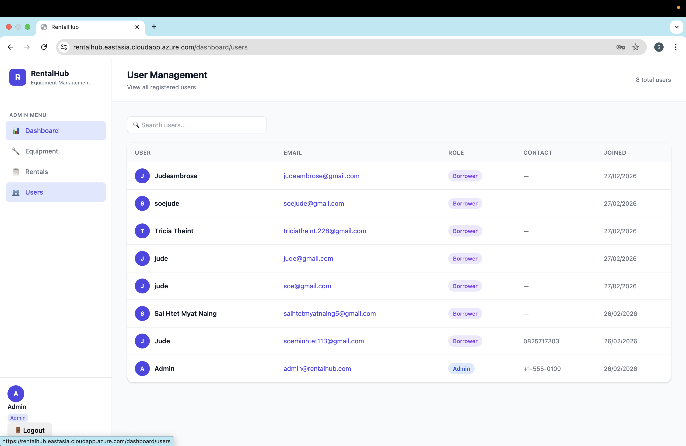
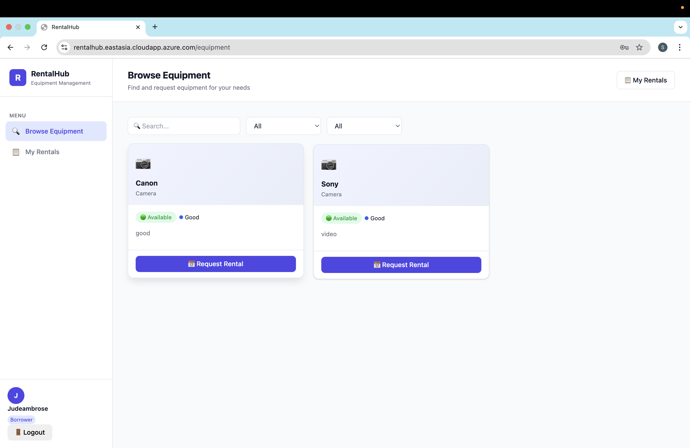
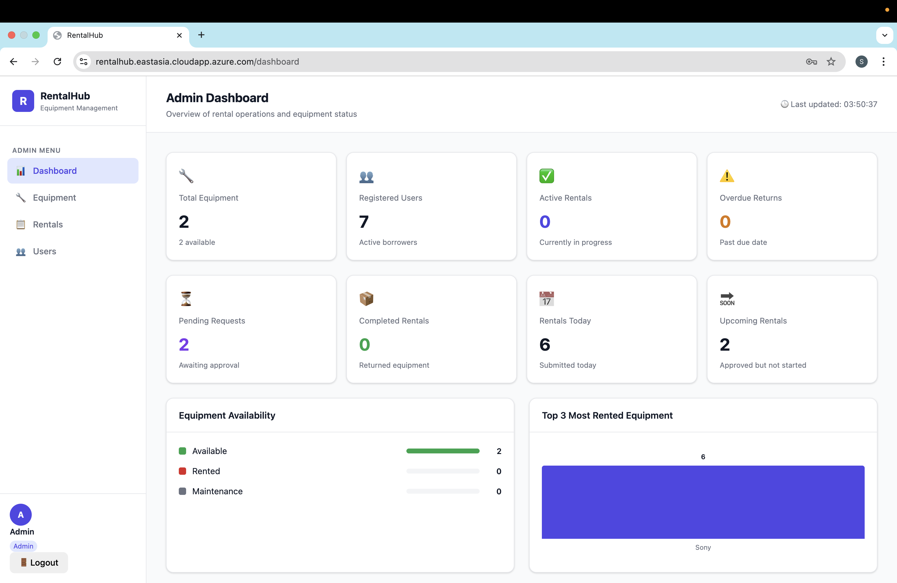
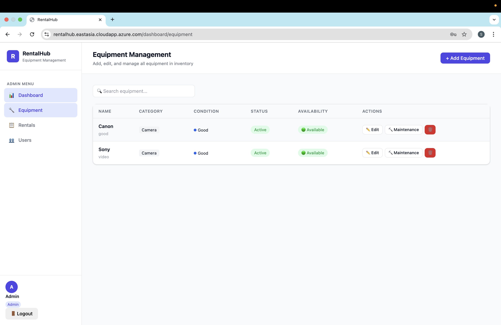
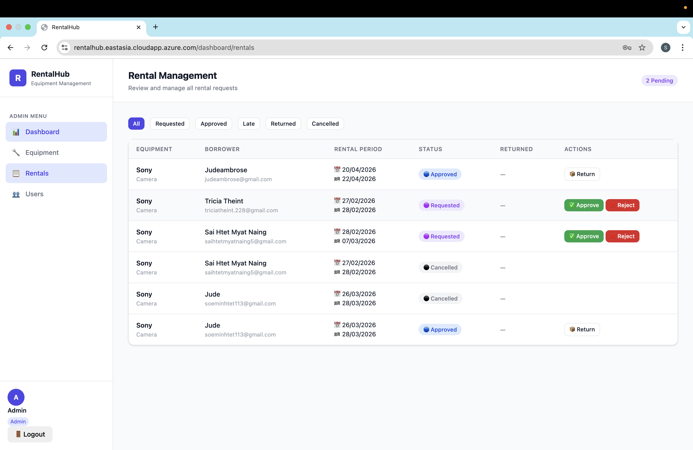

# RentalHub – Frontend

## 📌 Project Name  
RentalHub (Frontend)

## 👥 Team Members  
- **Lwin Moh Moh Theint** – Project Leader, Backend, Frontend  
  GitHub: https://github.com/Tricia28-cs  

- **Sai Khun Naung Hein** – Frontend  
  GitHub: https://github.com/liamted49  

- **Soe Min Htet** – Backend, Frontend  
  GitHub: https://github.com/judethesleeper  

## 📖 Project Description  
RentalHub is a web-based platform for finding and managing rental properties. Users can create accounts, browse rental listings, and manage their own listings and profile through a personal dashboard.

The frontend handles:
- Authentication pages (login/register)  
- Rental browsing and listing pages  
- User dashboard (profile management, listings management)  
- Image upload UI for profile pictures and listings  

The frontend communicates with the backend API to fetch and update data.

## 🖼️ Screenshots  

  
  





## ⚙️ Tech Stack  
- React / Next.js  
- Tailwind CSS / CSS  
- Fetch / Axios  

## 🚀 How to Run  

```bash
npm install
npm run dev